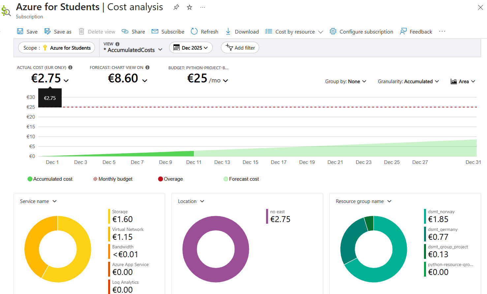

# Telco Customer Churn Prediction

## Project Summary

Customer churn is a critical business problem for telecommunications companies. Losing a customer is significantly more expensive than retaining one. This project delivers a machine learning solution that predicts which customers are likely to churn, enabling proactive retention strategies.

We built and deployed a logistic regression model using the IBM Telco Customer Churn dataset. The solution includes a REST API backend and an interactive web frontend, deployed on Azure Container Apps for scalability.

---

## Business Value

By identifying at-risk customers before they leave telecom providers can:

- Target retention offers to the right customers
- Reduce customer acquisition costs
- Improve customer lifetime value
- Make data-driven decisions about service improvements

---

## Model and Features

We use a logistic regression model as specified in the assignment. The model uses 11 features, including 2 additional features of contract type and payment method to improved predictive accuracy. These included:

- Customer tenure in months
- Monthly charges
- Tech support subscription
- Paperless billing preference
- Contract length
- Internet service type (3 mutually exclusive binary features)
- Payment method (4 mutually exclusive binary features)

### Model Performance

- Accuracy: approximately 80%
- ROC AUC: between 0.84-0.87
- Balanced precision and recall for business use

---

## System Architecture

The application follows a simple architecture:

1. Frontend: Streamlit was used as the interactive web interface where users input customer attributes and receive churn predictions
2. Backend: FastAPI used as the REST endpoint that processes requests and returns predictions
3. Machine Learning Model: Trained logistic regression model served via the API

The backend is containerized using Docker and deployed to Azure Container Apps for automatic scaling and a public URL. The budget was limited to the given limit of $25/month from an Azure student account.



---

## Interactive Frontend

We built a Streamlit-based web application that:

- Adjusts customer attributes using sliders and dropdowns
- Submits predictions with a single click
- Displays results with clear risk interpretation: either high or low churn probability, with any figure above 20% being considered high

---

## How to Run Locally

### Prerequisites

- Python 3.12+
- uv package manager

### Quick Start

```bash
# Clone the repository
git clone https://github.com/jay-teaching/group-project-python.git
cd group-project-python

# Set up environment
uv sync

# Start the backend
uv run uvicorn backend.main:app --port 8000

# In a new terminal, start the frontend
uv run streamlit run frontend/app.py
```

---

## How to Test the API

- API docs (Swagger UI):
  - [Local](http://localhost:8000/docs)
  - [Production](https://my-backend-env.ambitioussky-e0419ec9.swedencentral.azurecontainerapps.io/docs)
- You can test the prediction endpoint directly in your browser using these docs.

---

## Deployment

- Backend is deployed with Azure Container Apps using Docker.
- All deployment configuration and Dockerfiles are included in the repository.

---

## Project Structure

```text
group-project-python/
├── backend/main.py          # FastAPI REST API
├── frontend/app.py          # Streamlit web interface
├── prediction.py            # Core prediction logic
├── models/                  # Trained model files
├── notebooks/               # Model training notebook
├── tests/                   # Unit tests
├── Dockerfile.backend       # Container configuration
└── requirements.txt         # Dependencies
```

---

## Tech Stack

- Dataset: IBM Telco Customer Churn Dataset
- Cloud Platform: Microsoft Azure
- Frameworks: FastAPI, Streamlit, scikit-learn, UV, Marimo, pytest, Docker, Uvicorn

---
